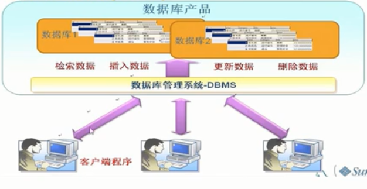
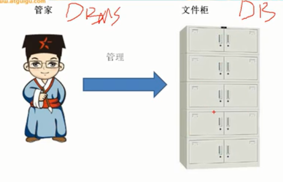

# 数据库的相关概念

## 三个重要概念

- （DB）数据库：存储数据的”仓库“，它保存了一系列有组织的数据
- (DBMS) 数据管理系统：数据库是通过DBMS创建和操作容器
- （SQL）结构化查询语言(Structure):专门用来与数据库通信的语言

## 数据库管理系统（DBMS）

1. 安装好数据库管理系统后就可以操作我们的容器，也就是数据库了
2. 常见的数据库管理系统有Mysql、Oracle（甲骨文公司收费比较贵）、DB2（IBM适合海量数据）、Sqlserver（微软）

- 数据库管理系统（DBMS）就好像一个管家，他管理文件柜数据库（DB）
- 程序员和DBMS对话，能让DBMS听得懂的语言叫做SQL

## SQL语言

SQL的优点

1. 不是某个特定数据库供应商专有的语言，几乎所有的DBMS都支持SQL
2. 简单易学
3. 虽然简单，但是实际上是一本强有力的语言，灵活运用其语言元素，可以进行非常复杂和高级的数据库操作

