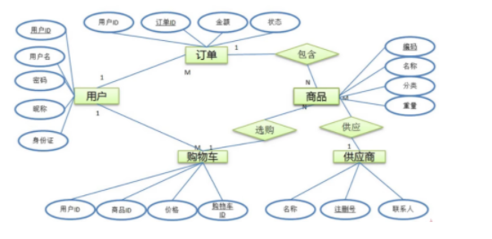

# 数据库设计

## 需求分析

### 1-1 数据库设计简介

**什么是数据库设计？**
简单来说，数据库设计就是根据业务系统的具体需要，结合我们所选用的数据库管理系统，为这个系统构造出最优的数据存储模型。并建立好数据库中的表结构及表与表之间的关联关系的过程。使之能有效的对应用系统中的数据进行存储，并可以高效对已经存储的数据进行访问。
常用的有关系型数据库有：mysql、sqlserver、oracle、pgsql
nosql：redis、mangodb、等等

**为什么要进行数据库设计？**
数据存储，高效访问

**优良的设计：**
减少数据冗余、避免数据维护异常、节约存储空间、高效访问

**糟糕的设计：**
存在大量冗余、存在数据插入、更新、删除异常、浪费大量存储空间、访问数据低效

### 1-2 数据库设计的步骤

**为什么要进行数据库设计？**
需求分析 - 逻辑设计 - 物理设计 - 维护优化

**数据库需求的作用点：**

1. 数据是什么？
2. 数据有哪些属性
3. 数据和属性各自的特点有哪些？

**逻辑设计：**
使用er图对数据库进行逻辑建模

**物理设计：**
根据数据库的自身特点将逻辑模型转换为物理模型

**维护优化：**

1. 新的需求进行建表（接到新的需求的时候，也要参照这些流程）
2. 索引优化
3. 大表拆分

### 1-3 需求分析的重要性简介

**为什么要进行需求分析？**

**为什么要进行需求分析？**

1. 了解系统中所要存储的数据
2. 了解数据的存储特点：时效性，不具有时效性（过期、清理、归档）
3. 了解数据的生命周期：快，数据量很大，但不是核心数据
4. 日志不适合存在数据库中。但是一定要存的话，要提前定义好清理和归档规则。随着上线进行归档和清理。

> 需求分析最好是在头脑风暴中进行碰撞然后确定下来的东西。

**需求分析主要讨论目标**

1. 了解系统中所有存储的数据
   1. 实体及实体之间的关系（1对1，1对多，多对多）
   2. 实体所包含的属性有什么？
   3. 哪些属性和属性的组合可以唯一标识一个实体
2. 了解数据的存储特点
3. 了解数据的生命周期

## 逻辑设计

### 2-1 ER图

将需求转换为数据库的逻辑模型
通过ER图的形式对逻辑模型进行展示
通所选用的数据库没关系

**名词解释：**
关系：一个关系对应通常所说的一张表
元组：表中的一行即为一个元组
属性：一列就是一个属性
候选码：表中的某个属性组
主码：一个关系中有多个候选码，选定其中一个做为主码
域: 属性的取值范围【男，女】
分量：元组中的一个属性值，男和女
矩形：表示实体集，矩形内写实体集的名字
菱形：表示联系集（将原先多对多的关系，转换为一对多的关系）
椭圆：表示实体的属性，加下标的就是主键
线段：将属性连接到实体集，或将实体集连接到联系集

### 2-2 设计范式概要

操作异常：
插入异常：如果实体随着另一个实体的存在而存在，既缺少某个实体时无法表示这个实体，这个表就存在插入异常
更新异常：如果更改表所对应的某个实体实例的单独属性时，需要将多行进行更新，那么久说这个表存在更新异常
删除异常：如果删除表的某一行来反映实例失效时导致拎一个不同实例信息丢失，那么这个表中就存在删除异常
数据冗余：相同的数据在多个地方存在，或者说表中的某个列能够由其他列计算得到，这样就存在数据冗余
数据库设计一般遵循的范式：第一范式、第二范式、第三范式、Dc范式、反范式设计、第四范式和第五范式一般不涉及。
插入异常、删除异常、更新异常、数据冗余（一般设计，是在反范式设计中为了提高性能，以及查询的方便程度来确认的）
一般互联网应用查询和更新的比例是4笔1或者3比1

### 2-3 第一范式

所有字段都是单一属性，不可再分，这个单一属性是由基本的数据类型所构成的

### 2-4 第二范式

定义：数据库中表不存在非关键字对于候选关键字的部分函数依赖
对于单主键一定符合第二范式

### 2-5 第三范式

不存在非关键字段对任意候选字段的传递函数依赖则符合第三范式
第一第二第三范式都是实体设计不合理，冗余数据，传递主键依赖，导致插入修改删除的异常。

### 2-6 BC范式

表中如果不存在任何字段对任一候选关键字段的传递函数依赖，则符合bc范式。
候选关键字的传递函数依赖。a 决定b b 决定a 但是都是候选关键字。
设计的时候最好都是单关键字的表，组合主键的最好少建立。

## 物理设计

### 3-1 数据库物理设计要做什么

1. 选择合适的数据库管理系统
2. 定义数据库、表及字段命名规范（按照数据库定义）
3. 对所选的dbms系统选择合适的字段类型：字段类型
4. 反范式化的设计，以空间换时间

### 3-2 选择哪种数据库

1. oracle（适合大的事务操作）
2. sqlserver（操作系统）开发语言使用的语言.net
3. mysql应用的场景
4. pgsql

### 3-3 MYSQL常用存储引擎

一般现在都是默认innodb，支持事务、行级表锁定，ndb cluster（是内存形式的，一般都不用）
archive使用场景适合日志

### 3-4 数据库表及字段类型选择原则

表及字段的命名规范：

1. 可读性原则，使用大小写来格式化数据库名来获得良好的可读性
2. 表意性原则
3. 长名性原则

### 3-5 数据库字段类型选择原则

生日：char、varchar、日期时间、Int时间戳
字段选择原则：优先选择数字类型、再次选择date类型、其次是char、最后才是varchar

以上选择原则：

1. 对数据进行比较（查询条件、join条件以及排序）操作时候：同样的数据字符处理往往比数字处理慢。
2. 数据库中数据处理以页为单位，列的长度越小，利于性能提升，io性能提高。数据库最大是磁盘io的瓶颈

### 3-6 数据库如何具体选字段类型

同类型：占用空间小的。整形优先
**char还是varchar来存储？**

1. 如果列中药存储的数据长度是差不多一致的，应该考虑使用char
2. 如果列中最大数据长度小于50byte，则一般也考虑使用char
3. 一般不定义大于50byte的char类型列（不同类型的占用是不相同的，utf8是三个字节的）

**decimal与float如何选择**

1. decimal用于存储精确数据，而float只能存储非精确数据。故精确数据只能选择decimal类型
2. 由于float存储空间开销一般比decimal小，精确到7位小数只需要4个字节，15为需要8个字节。故非精确数据优先选择float类型

**时间类型如何存储**

1. 使用int来存储时间字段（经常用的话还是使用date类型来存储）
   优点：字段小
   缺点：使用不方便，要进行函数转换
   限制：只能存储到2038-1-19
2. 需要存储时间粒度问题

### 3-7 数据库设计其他注意事项

**如何选择主键**

1. 区分业务主键和数据库主键
   业务主键用于标识业务数据，进行表与表之间的关联
   数据库主键为了优化数据存储，生成6字节的隐含主键
2. 根据数据库的类型，考虑主键是否要顺序增长
3. 主键的字段类型所占用的空间要近可能的小（io性能）
   **避免使用外键约束**
4. 降低数据导入的效率
5. 增加维护成本
6. 虽然不建议使用外键约束，但是相关联的列上一定要建立索引。
   **避免使用触发器**
7. 降低数据导入的效率
8. 可能出现意想不到的数据异常
9. 是业务逻辑变复杂
   **关于预留字段**
10. 无法知道预留字段的类型
11. 无法准确知道预留字段中所存储的内容
12. 后期维护预留字段所要的成本通增加一个字段所需的成本是相同的
13. 禁止使用预留字段

### 3-8 反范式化表设计

为了性能和读取效率对于第三范式进行违反，允许少量的数据冗余，提高读取效率。换句话说就是以空间换时间。

1. 减少表关联的数量
2. 增加数据的读取效率
3. 反范式化一定要适度（是可控的）

## 维护与优化

### 4-1 数据库维护和优化要做什么

1. 维护数据字段
2. 维护索引
3. 维护表结构
4. 在适当的时候对表进行水平拆分和垂直拆分

### 4-2 数据库如何维护数据字典

1. 使用第三方工具对于数据字典进行维护
2. 使用数据库本身的备注字段来维护数据字典
3. 导出数据字典，使用mysql内置表的形式

### 4-3 数据库如何维护索引

**如何维护索引**

1. 出现在where从句，group by从句、orderby 从句
2. 选择可选择性高的列要放到索引的前面
3. 索引中不要包括太长的数据类型，对于前面部分的进行索引，所以禁止全关联查询
   **注意事项：**
4. 索引并不是越多越好、过多的索引不但会降低写的效率（维护效率），还会降低读的效率（选择效率）。
5. 定期维护索引碎片
6. sql语句中不要使用强制索引关键字

### 4-4 数据库中适合的操作

**表结构维护：**

1. 使用在线变更表结构工具
2. 同时对数据字典进行维护
3. 控制表的宽度和大小
   **数据库中适合的操作**
4. 批量操作（sql） vs 逐条操作（存储过程）
5. 禁止使用select * 这样的函数查询
6. 控制使用用户自定义函数，对索引的时候产生影响
7. 不要使用数据库中的全文索引（需要另外建立全文索引，如果必要最好使用搜索引擎）

### 4-5 数据库表的垂直和水平拆分

为了控制表的宽度，可以进行表的垂直拆分：大表拆分小表（数据量是没有变化的）

1. 经常查询的列放到一起
2. text，blob等大字段拆分出到附加表中（优化io效率）
   为了控制表的大小可以进行表的水平拆分：
3. 通过主键hash的方式进行水平拆分，将五张表成为一张大表（优化表io）
   分库
   一个数据库已经没有办法将数据全部容纳下的时候，就需要使用。

### 数据库表设计要求

必须要有的字段：1. Id、2. 创建时间、3. 修改时间、4. 版本号、5. 逻辑删除标记

### 乐观锁：

对更新比较信任，一般不会出现同时更新的情况
同时读取到旧数据，同时对于数据进行更新

### 悲观锁：

对更新不信任，在进行更新的时候，会将表数据锁住，不允许读取，等到更新完毕后，在放开当前的锁。
能够保证在更新的时候，系统数据都是正确的。
要求改前将数据锁住，别人都不能够读取，将数据进行修改，提交后释放锁，别人才能够读取。