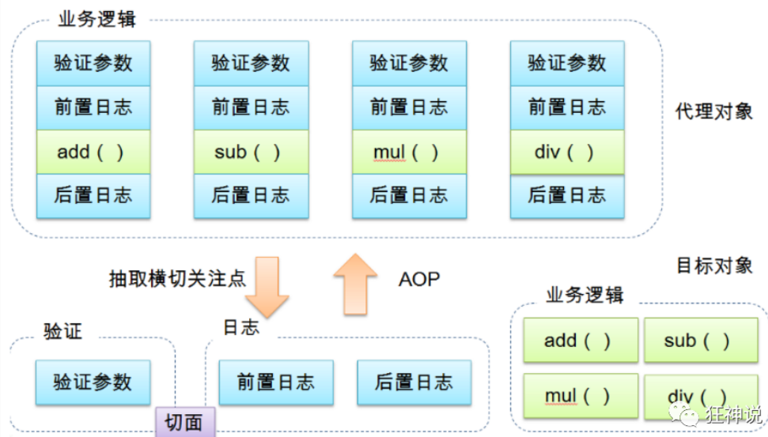
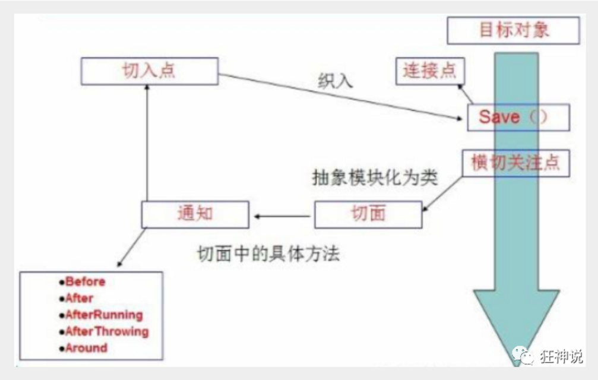
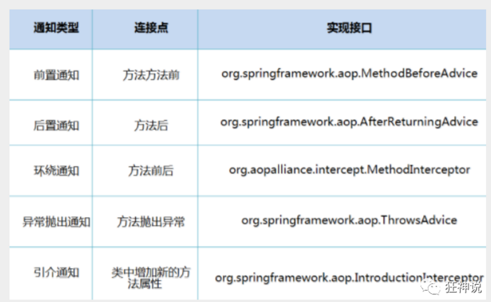

# AOP

## 什么是AOP
AOP(Aspect Oriented Programming)翻译为面向切面编程，通过预编译方式和运行期间动态代理实现程序功能的统一维护的一种技术。AOP是OOP的延续，是软件开发中的一个热点，也是Spring框架中的一个重要内容，是函数式编程的一种衍生泛型，利用AOP可以对业务逻辑的各个部分进行隔离，从而使得业务逻辑之间的耦合度降低，提高程序的可重用行，同时提高开发效率。

1. 我们的核心业务逻辑就是耕山改查
2. 但是公司现在要加入日志的功能
3. 我们不可以直接来修改代码，需要通过AOP来讲这些非核心业务的周边功能定义为切面，使得核心业务功能和切面功能分别独立进行开发，然后再把切面功能和核心业务功能编织在一起，就叫做AOP。

## AOP在Spring中的作用

提供声明式事务，允许用户自定义切面
一下的名词需要了解下：

- 横切关注点：跨越应用程序多个模块的方法和功能，即是，与我们业务逻辑无关的，但是我们需要关注的部分，就是横切关注点，比如日志，安全、缓存、事务
- 切面(ASPECT):横切关注点呗模块化的特殊对象，即它是一个类(日志类)
- 通知(ADVICE):切面所必须完成的工作，即他是类中一个方法(日志类中的一个方法)
- 目标(Target)：被通知的对象(接口)
- 代理(Proxy):向目标对象应用通知后创建的对象(生成的代理类)(代理类)
- 切入点(PointCut):切面通知执行的地点的定义(在哪里执行)
- 连接点(JoinPoint):与切入点匹配的执行点

在SpringAOP中，通过Advice定义横切逻辑，Spring中支持5种类型的Advice

1. 前置通知：在前面加一个方法
2. 后置通知：在后面加一个方法
3. 环绕通知：在前后都加上一个方法
4. 异常抛出通知：方法抛出异常
5. 引介通知：类中增加新的方法属性

