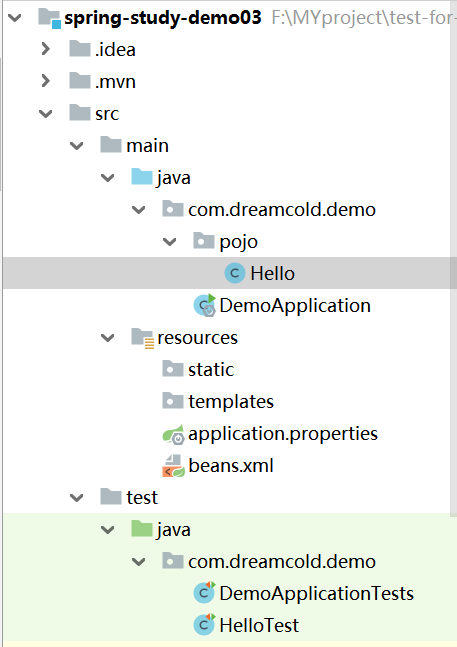
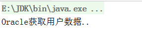

# 创建一个Spring的helloworld项目

1. 创建maven项目，导入Spring的环境依赖

可以参考:https://www.cnblogs.com/nwu-edu/p/9542074.html,为了简化直接导入webmvc的依赖
```java
<dependency>
        <groupId>org.springframework</groupId>
        <artifactId>spring-webmvc</artifactId>
        <version>4.3.7.RELEASE</version>
    </dependency>
```

2. 创建实体类

```java
package com.dreamcold.demo.pojo;

public class Hello {

    private String str;

    public String getStr() {
        return str;
    }

    public void setStr(String str) {
        this.str = str;
    }

    @Override
    public String toString() {
        return "Hello{" +
                "str='" + str + '\'' +
                '}';
    }

}

```

3. resource目录下创建beans.xml文件

- 传统的创建对象效果如下：
```
类型 变量名=new 类型();
```
- 现在我们交给bean来进行管理
```
id 等价于变量名
class 全路径类名
property 给对象的属性设置一个值
```

```xml
<?xml version="1.0" encoding="UTF-8"?>

<beans xmlns="http://www.springframework.org/schema/beans"
       xmlns:xsi="http://www.w3.org/2001/XMLSchema-instance"
       xsi:schemaLocation="http://www.springframework.org/schema/beans
    http://www.springframework.org/schema/beans/spring-beans-3.0.xsd">


    <bean id="hello" class="com.dreamcold.demo.pojo.Hello">
        <property name="str" value="spring"></property>
    </bean>

</beans>
```

5. 写一个测试

```java
package com.dreamcold.demo;

import com.dreamcold.demo.pojo.Hello;
import org.junit.jupiter.api.Test;
import org.springframework.context.ApplicationContext;
import org.springframework.context.support.ClassPathXmlApplicationContext;

public class HelloTest {

    @Test
    public void test(){

        //获取Spring的上下文对象
        ApplicationContext context=new ClassPathXmlApplicationContext("beans.xml");
        //我们的对象都在Spring中进行管理了，我们一旦使用直接从中取出来就可以了

        Hello hello= (Hello) context.getBean("hello");
        System.out.println(hello.toString());
    }
}

```

6. 结果


7. 目录结构



## 过程的总结

- Hello的对象是谁创建的，hello对象是Spring创建的
- Hello的对象属性是怎样设置的？hello对象的属性是由Spring容器设置的，这个过程就叫做控制反转
- 控制：谁来控制对象的创建，传统应用程序的对象是由程序本身控制创建的，使用Spring后，对象是由Spring来创建的
- 反转：程序本身不创建对象，而变成被动的接受对象
- 依赖注入：就是利用set方法来进行注入的
- IOC是一种编程思想，由主动编程被动的接受
- 可以通过newClassPathXmlApplicationContext去浏览底层源代码
- 到现在，我们彻底不用再改动程序了，要实现不同的操作，仅仅需要在xml配置文件中进行修改，所谓的ioc就是对象由Spring来创建，管理、装配


# 修改案例

在上一个案例中，我们可以让Spring来管理对象，我们首先要创建beans.xml

```java
<?xml version="1.0" encoding="UTF-8"?>

<beans xmlns="http://www.springframework.org/schema/beans"
       xmlns:xsi="http://www.w3.org/2001/XMLSchema-instance"
       xsi:schemaLocation="http://www.springframework.org/schema/beans
    http://www.springframework.org/schema/beans/spring-beans-3.0.xsd">


    <bean id="MysqlImpl" class="com.dreamcold.dao.UserDaoMysqlImpl">
    </bean>

    <bean id="OracleImpl" class="com.dreamcold.dao.UserDaoOracleImpl">
    </bean>

    <bean id="ServiceImpl" class="com.dreamcold.service.UserServiceImpl">
        <property name="userDao" ref="MysqlImpl"></property>
        <!--  普通对象用value，引用对象用ref   引用Spring中创建好的对象   -->
        <!--   Value是一个具体的值，比如基本数据类型     -->
    </bean>


</beans>
```

测试一下

```java

import com.dreamcold.service.UserService;

import org.springframework.context.ApplicationContext;
import org.springframework.context.support.ClassPathXmlApplicationContext;


public class MyTest {
    public static void main(String[] args) {
        ApplicationContext context=new ClassPathXmlApplicationContext("beans.xml");
        UserService userService=(UserService)context.getBean("ServiceImpl");
        userService.getUser();
    }
}

```

- 普通对象用value，引用对象用ref,引用Spring中创建好的对象
- Value是一个具体的值，比如基本数据类型

我们可以思考这样的好处，假如我们底层要修改实现的话，比如修改为Oracle实现,那么仅仅需要修改配置文件就可以了

```java
<?xml version="1.0" encoding="UTF-8"?>

<beans xmlns="http://www.springframework.org/schema/beans"
       xmlns:xsi="http://www.w3.org/2001/XMLSchema-instance"
       xsi:schemaLocation="http://www.springframework.org/schema/beans
    http://www.springframework.org/schema/beans/spring-beans-3.0.xsd">


    <bean id="MysqlImpl" class="com.dreamcold.dao.UserDaoMysqlImpl">
    </bean>

    <bean id="OracleImpl" class="com.dreamcold.dao.UserDaoOracleImpl">
    </bean>

    <bean id="ServiceImpl" class="com.dreamcold.service.UserServiceImpl">
        <property name="userDao" ref="OracleImpl"></property>
        <!--  普通对象用value，引用对象用ref   引用Spring中创建好的对象   -->
        <!--   Value是一个具体的值，比如基本数据类型     -->
    </bean>


</beans>
```

这样我们就避免了修改代码




