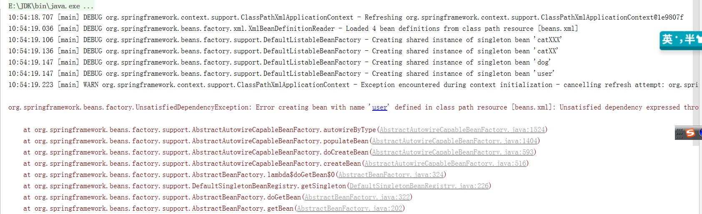

# 自动装配

## 自动装配说明

- 自动装配是使用spring满足bean依赖的一种方法
- spring会在上下文中位某个bean寻找其依赖的bean

Spring中bean1有三种装配机制，分别是
1. 在xml中的显式配置
2. 在Jav显式配置
3. 隐式的bean发现机制和自动装配


这里主要讲第三种，自动化装配Bean
 Spring的自动装配需要从两个角度来实现，或者说有两个操作
 1. 组件扫描（component scaning):spring会自动发现应用上下文中所创建的bean
 2. 自动装配(autowiring):spring自动满足bean之间的依赖，也就是我们说的IOC、DI

 ==推荐不使用自动装配xml配置，而使用注解==


## 测试环境搭建

1. 新建一个项目

2. 新建两个实体类

1. Cat类
```java
package com.dreamcold.demo.pojo;

public class Cat {

    public void shout(){
        System.out.println("miao~~~");
    }
}
```

2. Dog类

```java
package com.dreamcold.demo.pojo;

public class Dog {

    public void shout(){
        System.out.println("wang~~~");
    }
}

```

3. User类

```java
package com.dreamcold.demo.pojo;

public class User {
    private Cat cat;
    private Dog dog;
    private String str;

    public Cat getCat() {
        return cat;
    }

    public void setCat(Cat cat) {
        this.cat = cat;
    }

    public Dog getDog() {
        return dog;
    }

    public void setDog(Dog dog) {
        this.dog = dog;
    }

    public String getStr() {
        return str;
    }

    public void setStr(String str) {
        this.str = str;
    }

    @Override
    public String toString() {
        return "User{" +
                "cat=" + cat +
                ", dog=" + dog +
                ", str='" + str + '\'' +
                '}';
    }
}

```

4. 测试

```java
package com.dreamcold.demo;

import com.dreamcold.demo.pojo.User;
import org.junit.jupiter.api.Test;
import org.springframework.context.ApplicationContext;
import org.springframework.context.support.ClassPathXmlApplicationContext;

public class HelloTest {

    @Test
    public void test(){
        ApplicationContext context=new ClassPathXmlApplicationContext("beans.xml");
        //我们的对象都在Spring中管理
        User user=(User)context.getBean("user");
        System.out.println(user);
        user.getCat().shout();
        user.getDog().shout();
    }
}

```

结果正常输出，环境OK


### byName(按照名称自动装配)

由于在手动配置xml的过程中，常常发生字母缺漏和大小写等错误，而无法对其进行检查，使得开发侠侣降低
采用自动装配将避免这些错误，并且使其配置简单化。
测试

1. 修改bean配置，增加一个属性 autowire="byName"

```xml
<?xml version="1.0" encoding="UTF-8"?>

<beans xmlns="http://www.springframework.org/schema/beans"
       xmlns:xsi="http://www.w3.org/2001/XMLSchema-instance"
       xmlns:p="http://www.springframework.org/schema/p"
       xmlns:c="http://www.springframework.org/schema/c"
       xsi:schemaLocation="http://www.springframework.org/schema/beans
    http://www.springframework.org/schema/beans/spring-beans-3.0.xsd">

    <bean id="cat" class="com.dreamcold.demo.pojo.Cat">

    </bean>

    <bean id="dog" class="com.dreamcold.demo.pojo.Dog">

    </bean>

    <bean id="user" class="com.dreamcold.demo.pojo.User" autowire="byName">

        <property name="str" value="yujian">

        </property>

    </bean>
</beans>
```

2. 再次测试，结果依旧成功输出！

3. 我们将 cat 的bean id修改为 catXXX

4. 再次测试， 执行时报空指针java.lang.NullPointerException。因为按byName规则找不对应set方法，真正的setCat就没执行，对象就没有初始化，所以调用时就会报空指针错误。


```xml
<?xml version="1.0" encoding="UTF-8"?>

<beans xmlns="http://www.springframework.org/schema/beans"
       xmlns:xsi="http://www.w3.org/2001/XMLSchema-instance"
       xmlns:p="http://www.springframework.org/schema/p"
       xmlns:c="http://www.springframework.org/schema/c"
       xsi:schemaLocation="http://www.springframework.org/schema/beans
    http://www.springframework.org/schema/beans/spring-beans-3.0.xsd">

    <bean id="catXXX" class="com.dreamcold.demo.pojo.Cat">

    </bean>

    <bean id="dog" class="com.dreamcold.demo.pojo.Dog">

    </bean>

    <bean id="user" class="com.dreamcold.demo.pojo.User" autowire="byName">

        <property name="str" value="yujian">

        </property>

    </bean>
</beans>
```

**小结**

- 当一个bean节点带有autowire byName的属性的时候
    - 将查找其类中的所有set方法名，例如setCat,将获得set去掉并且首字母小写的字符串
    - 去spring容器中寻找是否有该字符串名称的id的对象


### byType

autowire byType (按类型自动装配)

使用autowire byType首先需要保证，同一个类型的对象，在spring容器中唯一，如果不唯一，会报不唯一的异常。

```
NoUniqueBeanDefinitionException
```

测试：
1. 将user的bean配置修改一下，autowire="bytype"
2. 测试，正常输出

3. 在注册一个cat的bean对象

```xml
<?xml version="1.0" encoding="UTF-8"?>

<beans xmlns="http://www.springframework.org/schema/beans"
       xmlns:xsi="http://www.w3.org/2001/XMLSchema-instance"
       xmlns:p="http://www.springframework.org/schema/p"
       xmlns:c="http://www.springframework.org/schema/c"
       xsi:schemaLocation="http://www.springframework.org/schema/beans
    http://www.springframework.org/schema/beans/spring-beans-3.0.xsd">

    <bean id="catXXX" class="com.dreamcold.demo.pojo.Cat">

    </bean>


    <bean id="dog" class="com.dreamcold.demo.pojo.Dog">

    </bean>

    <bean id="user" class="com.dreamcold.demo.pojo.User" autowire="byType">

        <property name="str" value="yujian">

        </property>

    </bean>
</beans>
```

4. 假设我们在容器中再次注册一个cat对象

```xml

<?xml version="1.0" encoding="UTF-8"?>

<beans xmlns="http://www.springframework.org/schema/beans"
       xmlns:xsi="http://www.w3.org/2001/XMLSchema-instance"
       xmlns:p="http://www.springframework.org/schema/p"
       xmlns:c="http://www.springframework.org/schema/c"
       xsi:schemaLocation="http://www.springframework.org/schema/beans
    http://www.springframework.org/schema/beans/spring-beans-3.0.xsd">

    <bean id="catXXX" class="com.dreamcold.demo.pojo.Cat">

    </bean>


    <bean id="catXX" class="com.dreamcold.demo.pojo.Cat">

    </bean>


    <bean id="dog" class="com.dreamcold.demo.pojo.Dog">

    </bean>

    <bean id="user" class="com.dreamcold.demo.pojo.User" autowire="byType">

        <property name="str" value="yujian">

        </property>

    </bean>
</beans>
```

那么就会报错：




5. 删掉catXX，将cat的bean名称改掉！测试！因为是按类型装配，所以并不会报异常，也不影响最后的结果。甚至将id属性去掉，也不影响结果。

这就是按照类型自动装配！


### 使用注解

自从JDK1.5开始支持注解，spring2.5开始全面支持注解。准备工作，利用注解的方式注入属性

1. 在spring配置文件中引入context头

```xml
<?xml version="1.0" encoding="UTF-8"?>
<beans xmlns="http://www.springframework.org/schema/beans"
       xmlns:xsi="http://www.w3.org/2001/XMLSchema-instance"
       xmlns:context="http://www.springframework.org/schema/context"
       xsi:schemaLocation="http://www.springframework.org/schema/beans
       http://www.springframework.org/schema/beans/spring-beans.xsd
       http://www.springframework.org/schema/context
       http://www.springframework.org/schema/context/spring-context.xsd
">

    <context:annotation-config/>

</beans>
```

#### @Autowired

- @Autowired是按类型自动转配的，不支持id匹配。

- 需要导入 spring-aop的包！

测试：

1、将User类中的set方法去掉，使用@AutoWired注解

```java
package com.dreamcold.demo.pojo;

import org.springframework.beans.factory.annotation.Autowired;

public class User {

    @Autowired
    private Cat cat;

    @Autowired
    private Dog dog;
    private String str;

    public Cat getCat() {
        return cat;
    }

    public void setCat(Cat cat) {
        this.cat = cat;
    }

    public Dog getDog() {
        return dog;
    }


    @Override
    public String toString() {
        return "User{" +
                "cat=" + cat +
                ", dog=" + dog +
                ", str='" + str + '\'' +
                '}';
    }
}

```

- AutoWired(required=false)说明false,对象可以为null，对象必须存对象，不能为null
- 如果允许对象为null,设置required=false,默认为true

```java
@AutoWired(required=false)
private Cat cat;
```

#### Qualifier

- Autowired是根据类型自动装配的，加上Qualifier则可以根据byName的方式来进行自动装配
- Qualifier不能单独使用

测试实验步骤

1. 配置文件修改内容，保证类型存在对象，且名字不可以为类的默认名字!

```xml
<?xml version="1.0" encoding="UTF-8"?>
<beans xmlns="http://www.springframework.org/schema/beans"
       xmlns:xsi="http://www.w3.org/2001/XMLSchema-instance"
       xmlns:context="http://www.springframework.org/schema/context"
       xsi:schemaLocation="http://www.springframework.org/schema/beans
       http://www.springframework.org/schema/beans/spring-beans.xsd
       http://www.springframework.org/schema/context
       http://www.springframework.org/schema/context/spring-context.xsd
">

    <context:annotation-config/>

    <bean id="cat1" class="com.dreamcold.demo.pojo.Cat"></bean>
    <bean id="cat2" class="com.dreamcold.demo.pojo.Cat"></bean>
    <bean id="dog1" class="com.dreamcold.demo.pojo.Dog"></bean>
    <bean id="dog2" class="com.dreamcold.demo.pojo.Dog"></bean>
</beans>
```

```java
package com.dreamcold.demo;

import com.dreamcold.demo.pojo.User;
import org.junit.jupiter.api.Test;
import org.springframework.context.ApplicationContext;
import org.springframework.context.support.ClassPathXmlApplicationContext;

public class HelloTest {

    @Test
    public void test(){
        ApplicationContext context=new ClassPathXmlApplicationContext("beans.xml");
        //我们的对象都在Spring中管理
        User user=(User)context.getBean("user");
        System.out.println(user);
        user.getCat().shout();
        user.getDog().shout();
    }
}

```

2. 没有加Qualifier测试直接报错
3. 在属性上添加Qualifier注解

```java
package com.dreamcold.demo.pojo;

import org.springframework.beans.factory.annotation.Autowired;
import org.springframework.beans.factory.annotation.Qualifier;

public class User {

    @Autowired
    @Qualifier("cat1")
    private Cat cat;

    @Autowired
    @Qualifier("dog2")
    private Dog dog;
    private String str;

    public Cat getCat() {
        return cat;
    }

    public void setCat(Cat cat) {
        this.cat = cat;
    }

    public Dog getDog() {
        return dog;
    }


    @Override
    public String toString() {
        return "User{" +
                "cat=" + cat +
                ", dog=" + dog +
                ", str='" + str + '\'' +
                '}';
    }
}

```

#### @Resource

- @Resource如果有指定name属性，先按照属性进行byName方式查找装配
- 其次再进行默认的byName方式进行装配
- 如果以上都不成功，则按照byType的方式进行装配
- 都不成功则报异常

实体类：

```java
package com.dreamcold.demo.pojo;

import org.springframework.beans.factory.annotation.Autowired;
import org.springframework.beans.factory.annotation.Qualifier;

import javax.annotation.Resource;


public class User {

//按照名字查找可以找到
    @Resource(name = "cat2")
    private Cat cat;

//按照名称查找dog
    @Resource
    private Dog dog;
    private String str;

    public Cat getCat() {
        return cat;
    }

    public void setCat(Cat cat) {
        this.cat = cat;
    }

    public Dog getDog() {
        return dog;
    }


    @Override
    public String toString() {
        return "User{" +
                "cat=" + cat +
                ", dog=" + dog +
                ", str='" + str + '\'' +
                '}';
    }
}

```

beans.xml

```xml
<?xml version="1.0" encoding="UTF-8"?>
<beans xmlns="http://www.springframework.org/schema/beans"
       xmlns:xsi="http://www.w3.org/2001/XMLSchema-instance"
       xmlns:context="http://www.springframework.org/schema/context"
       xsi:schemaLocation="http://www.springframework.org/schema/beans
       http://www.springframework.org/schema/beans/spring-beans.xsd
       http://www.springframework.org/schema/context
       http://www.springframework.org/schema/context/spring-context.xsd
">

    <context:annotation-config/>

    <bean id="cat1" class="com.dreamcold.demo.pojo.Cat"></bean>
    <bean id="cat2" class="com.dreamcold.demo.pojo.Cat"></bean>
    <bean id="dog1" class="com.dreamcold.demo.pojo.Dog"></bean>
    <bean id="dog2" class="com.dreamcold.demo.pojo.Dog"></bean>
    <bean id="dog"  class="com.dreamcold.demo.pojo.Dog"></bean>


    <bean id="user" class="com.dreamcold.demo.pojo.User"></bean>
</beans>
```

测试结果ok!


配置文件2


```xml
<?xml version="1.0" encoding="UTF-8"?>
<beans xmlns="http://www.springframework.org/schema/beans"
       xmlns:xsi="http://www.w3.org/2001/XMLSchema-instance"
       xmlns:context="http://www.springframework.org/schema/context"
       xsi:schemaLocation="http://www.springframework.org/schema/beans
       http://www.springframework.org/schema/beans/spring-beans.xsd
       http://www.springframework.org/schema/context
       http://www.springframework.org/schema/context/spring-context.xsd
">

    <context:annotation-config/>

    <bean id="cat1" class="com.dreamcold.demo.pojo.Cat"></bean>
    <bean id="dog"  class="com.dreamcold.demo.pojo.Dog"></bean>


    <bean id="user" class="com.dreamcold.demo.pojo.User"></bean>
</beans>
```


实体类上只保留注解

```java
@Resource
private Cat cat;
@Resource
private Dog dog;
```

结果：OK

结论：先进行byName查找，失败；再进行byType查找，成功。

## 总结

Autowired与Resource异同：
- @Autowired与Resource都可以用来装配bean。都可以写在字段上，或者写在setter方法上

- Autowired默认按照类型装配(属于Spring规范)，默认情况下必须要求依赖对象必须存在，如果要允许null值，可以设置它的require属性为false，如：@Autowired(required=false)，如果我们想使用名称装配可以结合@Qualifier注解进行进行

- @Resource(属于J2EE复返)，默认按照名称进行装配，名称可以通过name属性进行制定。如果没有name属性，当注解卸载字段上，默认取字段名进行按照名称查找，如果注解卸载setter方法上默认取属性名进行装配，当找不到与名称匹配bean时候才按照类型进行装配，但是需要注意的是，如果name属性一旦确定，就智慧按照名称进行装配。


它们的作用相同都是用注解方式注入对象，但执行顺序不同。@Autowired先byType，@Resource先byName。


