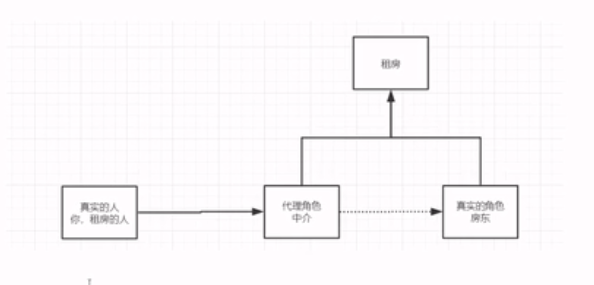
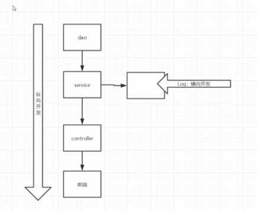

# 静态代理模式

为什么要学习代理模式？因为这就是SpringAop的底层!
代理模式的分类:
* 动态代理
* 静态代理




角色分析：
1. 抽象角色：一般会使用接口和抽象类来解决
2. 真实角色：被代理的角色
3. 代理角色：代理真实角色，代理真实角色只有，我们一般会做一些附属的操作
4. 客户：访问代理对象的人

代理模式的好处:
1. 可以使得真实的角色的操作更加纯粹，不必要去关注一些公共的业务
2. 公共也交给了代理角色，实现了业务的分工！
3. 公共的业务扩展的时候方便集中管理


代码步骤
1. 接口
```java
package com.dreamcold.aop.demo;
//租房的接口，真实角色和代理角色都需要实现该接口
public interface Rent {

    public void rent();
}

```
2. 真实角色
```java
package com.dreamcold.aop.demo;
//房东
public class Host implements Rent{
    public void rent() {
        System.out.println("房东要出租房子!");
    }
}
```
3. 代理角色
```java
package com.dreamcold.aop.demo;

public class Proxy implements Rent{

    private Host host;


    public Proxy(){

    }

    public Proxy(Host host) {
        this.host = host;
    }


    public void seeHouse(){
        System.out.println("中介带你看房!");
    }


    public void rent() {
        seeHouse();
        this.host.rent();
        fee();
        signAContract();
    }

    public void fee(){
        System.out.println("收中介费!");
    }

    public void signAContract(){
        System.out.println("签署合同!");
    }

}

```
4. 客户端访问代理角色

```java
package com.dreamcold.aop.demo;

public class Main {
    public static void main(String[] args) {
        Host host=new Host();
        Proxy proxy=new Proxy(host);
        proxy.rent();
    }
}

```


缺点：
1. 一个真实角色就会产生一个代理角色，代码量会翻倍-开发效率会降低

加深理解

1. 首先我们定义一个userService的服务接口

```java
package com.dreamcold.aop.demo01;


public interface UserService {

    //增
    public void insert();
    //改
    public void update();
    //删
    public void delete();
    //查找
    public void find();
}

```

2. 定义其的实现类userServiceImpl

```java
package com.dreamcold.aop.demo01;

public class UserServiceImpl implements UserService {
    public void insert() {
        System.out.println("增加了一个用户!");
    }

    public void update() {
        System.out.println("删除了一个用户!");
    }

    public void delete() {
        System.out.println("修改了一个用户!");
    }

    public void find() {
        System.out.println("查询了一个用户!");
    }
}

```

5. 现在我们希望再每个改查增删的业务逻辑中添加日志

```java
package com.dreamcold.aop.demo01;

public class UserServiceImpl implements UserService {
    public void insert() {
        System.out.println("日志：增加了用户");
        System.out.println("增加了一个用户!");
    }

    public void update() {
        System.out.println("日志：更新了用户");
        System.out.println("删除了一个用户!");
    }

    public void delete() {
        System.out.println("日志：删除了用户");
        System.out.println("修改了一个用户!");
    }

    public void find() {
        System.out.println("日志：查找了用户");
        System.out.println("查询了一个用户!");
    }
}

```
目前仅仅只有四个方法，可能觉得这样写还好，但是当方法一旦增加到无数方法后，那么这样的修改的代码量会很多，我们希望再补改变原有代码量的前提下对其进行改进，我们设置一个代理角色。

```java
package com.dreamcold.aop.demo01;

public class UserServiceProxy implements UserService {

    private UserService userService;

    public void setUserService(UserService userService) {
        this.userService = userService;
    }

    public void insert() {
        log("add");
        userService.insert();
    }

    public void update() {
        log("update");
        userService.update();
    }

    public void delete() {
        log("delete");
        userService.delete();
    }

    public void find() {
        log("find");
        userService.find();
    }

    private void log(String msg){
        System.out.println("使用了"+msg+"方法！");
    }
}

```

客户端调用


```java
package com.dreamcold.aop.demo01;

public class Client {
    public static void main(String[] args) {
        UserService userService=new UserServiceImpl();
        UserServiceProxy userServiceProxy=new UserServiceProxy();
        userServiceProxy.setUserService(userService);
        userServiceProxy.find();
    }
}

```

为什么我们加入日志功能不可以在原有的代码上加，因为改变原有的代码在公司中是大忌，容易改崩掉

AOP的思想



1. 我们原本的开发流程是前端调用controller层、controller层调用service层、service层调用dao层
2. 随着业务量的增加，原来的系统出现了BUG，我希望能在原来的系统中加入日志的功能，我需要在原有的层中横切进去，加入service层
3. 即横切进去，设置代理类，在不改变原有代码的情况下，增加新的功能
