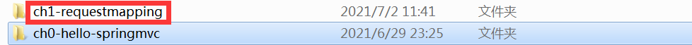
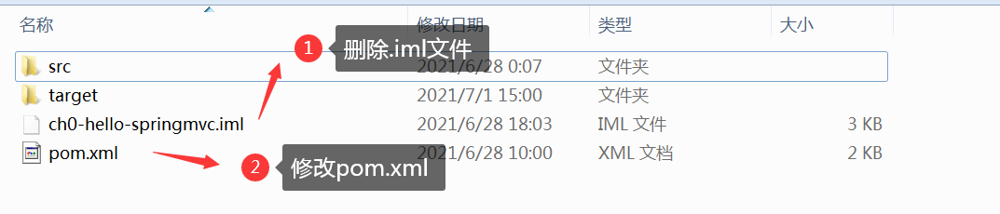
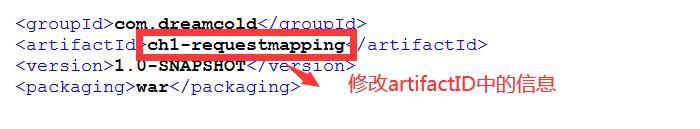
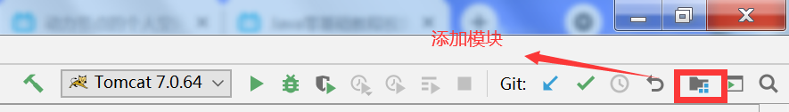
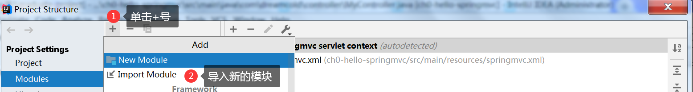
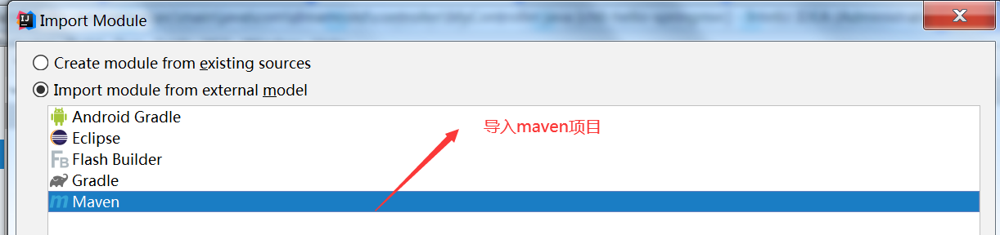
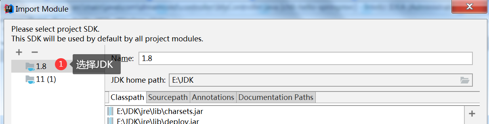

# SpringMVC注解式开发

## 前期准备

1. 将之前写好的项目进行复制并重命名为`ch1-requestmapping`



2. 删除`.iml`文件，并修改pom.xml文件



3. 修改`pom.xml`中的`artifactId`为`ch1-requestmapping`



4. 点击添加模块



5. 单价+号，导入模块



6. 导入maven项目



7. 一路`next`,选择`JDK`，最后关闭



## 作用在类上的RequestMapping注解

1. 作用在方法上的`@RequestMapping`注解通常可以映射请求，通常可以在访问地址前面加上相应的其他分目录

```java
 	@RequestMapping(value = "/test/some.do")
    public ModelAndView doSome(){
        //处理请求
    }

 	@RequestMapping(value = "/test/other.do")
    public ModelAndView doOther(){
        //处理请求
    }
```

2. 我们发现每个方法的前面路径都有`/test/`，我们看有些冗余，能不能将其统一放到前面的类中进行集中的定义

```java
/**
 * @Controller创建处理器对象
 * @RequestMapping处理请求
 * value
 * 所有请求地址的公共部分，叫做模块名称
 * 位置:放在类的上面
 */
@Controller(value="myController")
@RequestMapping("/test")
public class MyController {

    @RequestMapping(value = "/some.do")
    public ModelAndView doSome(){
        //处理请求
    }
    
    @RequestMapping(value = "/other.do")
    public ModelAndView doOther(){
        //处理请求
    }
    
}
```

## 指定请求方式

普通浏览器 只支持get post方式 ；其他请求方式 如 delelte、put请求是通过 过滤器新加入的支持。

| 请求方式 | 描述 |
| -------- | ---- |
| GET      | 查   |
| POST     | 增   |
| DELETE   | 删   |
| PUT      | 改   |

```java
@Controller
@RequestMapping("/user")
public class UserController {
    /**
     * @RequestMapping注解
     * 属性: method，表示请求的方式。 它的值RequestMethod类故举值。
     * 例如表示get请求方式，RequestMethod.GET
     * post方式，RequestMethod. POST
     *你不用get方式，错误是
	 *HTTP status 405 - Request method 'GET' not supported
     * @return
     */
    @RequestMapping(value = "/get",method = RequestMethod.GET)
    public ModelAndView getUsers(){
         //处理请求
        return null;
    }

    @RequestMapping(value = "/post",method = RequestMethod.POST)
    public ModelAndView updateUser(){
          //处理请求
        return null;
    }
}
```

## 接收用户请求参数

### 逐个参数接收

处理器方法可以包含以下四类参数，这些参数会在系统调用时由系统自动赋值，即程序
员可在方法内直接使用。

- HttpServletRequest
- HttpServletResponse
- HttpSession
- 请求中所携带的请求参数

```java
@Controller
@RequestMapping("/user")
public class UserController {
    /**
     * @RequestMapping注解
     * 属性: method，表示请求的方式。 它的值RequestMethod类故举值。
     * 例如表示get请求方式，RequestMethod.GET
     * post方式，RequestMethod. POST
     * @return
     */
    @RequestMapping(value = "/get.do",method = RequestMethod.GET)
    public ModelAndView getUsers(HttpServletRequest req, HttpServletResponse rep, HttpSession session){
        ModelAndView mv=new ModelAndView();
        mv.addObject("msg","请求参数为"+req.getParameter("name"));
        mv.setViewName("user");
        return mv;
    }
}
```

### 请求中携带参数

例如比如表单的提交

```html
    <form action="/user/post.do" method="post">
        姓名：<input type="text" name="name"><br/>
        年龄: <input type="text" name="age"><br/>
        <input type="submit" name="提交参数">
    </form>
```

相应的`Controller`接收相应的参数

```java
    /**
     * 逐个接受请求参数
     * 要求:处理器( 控利器)方法的形参名和请求中参数名必须一致。
     * 同名的请求参数具值给同名的形参
     * 1.使用request对象接收请求参数
     * string strName = reques t . getParameter( "name" ) ;
     * string strAge = request . getParameter( "age”);
     * 2. springmvc 框架通过DispatcherServlet 调用MyController的doSome()方法
     * 调用方法时，按名称对应，把接收的参数飘值给形参
     * dosome ( strName，Integer.valueOf(str) )
     * 框架会提供类型转换的功能，能把String转为int， long
     * float，double等类型。
     * @return
     */
    @RequestMapping(value = "/post",method = RequestMethod.POST)
    public ModelAndView updateUser(String name,int age){
        ModelAndView mv=new ModelAndView();
        mv.addObject("name",name);
        mv.addObject("age",age);
        mv.setViewName("show");
        return mv;
    }
```

### 接收参数过滤器

注册声明过滤器解决post请求乱码的问题，`web.xml`如下定义:

```xml
    <filter>
        <filter-name>CharacterEncodingFilter</filter-name>
        <filter-class>org.springframework.web.filter.CharacterEncodingFilter</filter-class>
        <!-- 设置项目中采用的字符编码       -->
        <init-param>
            <param-name>encoding</param-name>
            <param-value>utf-8</param-value>
        </init-param>
        <!-- 强制请求对象( HttpServletRequest )使用encoding编码的值      -->
        <init-param>
            <param-name>forceRequestEncoding</param-name>
            <param-value>true</param-value>
        </init-param>
        <!--应答对象-->
        <init-param>
            <param-name>forceResponseEncoding</param-name>
            <param-value>true</param-value>
        </init-param>
    </filter>
    <!--所有请求经过过滤器-->
    <filter-mapping>
        <filter-name>CharacterEncodingFilter</filter-name>
        <url-pattern>/*</url-pattern>
    </filter-mapping>
```

### RequestParam注解

请求中参数名和处理器方法的形参名不一样
RequestParam;解决请求中参数名形参名不一样的问题

- 属性：value 请求中的参数名称
- 位置:在处理器方法的形参定文的前面
- 属性：required是-个boolean ,默认是true
- true :表示请求中必须包含此参

```java
    @RequestMapping(value = "/post",method = RequestMethod.POST)
    public ModelAndView updateUser(@RequestParam("rname") String name,@RequestParam("rnaame") int age){
        ModelAndView mv=new ModelAndView();
        mv.addObject("name",name);
        mv.addObject("age",age);
        mv.setViewName("show");
        return mv;
    }
```

[细节参考](https://blog.csdn.net/sswqzx/article/details/84195043)

### 对象接收参数

1. 创建接收值的对象

```java
package com.dreamcold.vo;
/**
 * //保存请求参数值的一个普通类
 */
public class Student {
    //属性名与请求参数名一致
    private String name;
    private Integer age;
   //无参数构造器
   //getter、setter方法
}
```


2. 处理器方法形参是java对象，这个对象的属性名和请求中参数名-样的,框架会创建形参的java对象，給属性赋值。请求 中的参数是name，框架会调用setName()

```java
    /**
     * 处理器方法形参是java对象，这个对象的属性名和请求中参数名-样的
     * 框架会创建形参的java对象，給属性赋值。请求 中的参数是name，框架会调用setName()
     * @param stu
     * @return
     */
    @RequestMapping(value = "/post",method = RequestMethod.POST)
    public ModelAndView updateUser(Student stu){
        ModelAndView mv=new ModelAndView();
        mv.addObject("name",stu.getName());
        mv.addObject("age",stu.getAge());
        mv.setViewName("show");
        return mv;
    }
```

## 处理器方法与返回值

### 返回ModelAndView

​	若处理器方法处理完后，需要跳转到其它资源，且又要在跳转的资源间传递数据，此时处理器方法返回ModelAndView比较好。当然，若要返回ModelAndView,则处理器方法中需要定义ModelAndView对象。
​	在使用时，若该处理器方法只是进行跳转而不传递数据，或只是传递数据而并不向任何资源跳转(如对页面的Ajax异步响应)，此时若返回ModelAndView，则将总是有一部分多余:要么Model多余，要么View多余。即此时返回ModelAndView将不合适。

### 返回字符串

- 处理器方法返回的字符串可以指定逻辑视图名,通过视图解析器解析可以将共转换为物理视图地址。
- 表示视图的跳转

```java
    @RequestMapping(value = "/skip",method = RequestMethod.GET)
    public String skipView(String name,Integer age){
        return "show";
    }
```

### 返回Void

- 处理`Ajax`的时候可以采用返回值为`void`
- 通过`HttpServletResponse`输出数据。响应ajax请求

1. 导入jackson的依赖

```xml
<!-- https://mvnrepository.com/artifact/com.fasterxml.jackson.core/jackson-databind -->
<dependency>
  <groupId>com.fasterxml.jackson.core</groupId>
  <artifactId>jackson-databind</artifactId>
  <version>2.10.0</version>
</dependency>

<dependency>
  <groupId>com.fasterxml.jackson.core</groupId>
  <artifactId>jackson-annotations</artifactId>
  <version>2.10.0</version>
</dependency>

<dependency>
  <groupId>com.fasterxml.jackson.core</groupId>
  <artifactId>jackson-core</artifactId>
  <version>2.10.0</version>
</dependency>
```

2. 通过`jquery`来发起`ajax`请求

```jsp
<%@ page contentType="text/html;charset=UTF-8" language="java" %>
<html>
<head>
    <title>Title</title>
    <script src="http://ajax.aspnetcdn.com/ajax/jQuery/jquery-1.8.0.js">
    </script>
    <script>
        $(function () {
            $("button").click(function () {
                $.ajax({
                    url:"/ajax",
                    data:{
                        name:"zhangsan",
                        age:20
                    },
                    type:"post",
                    dataType:"json",
                    sucess:function (resp) {
                        alert(resp);
                    }
                })
            })
        })
    </script>
</head>
<body>
    <button id="btn"></button>
</body>
</html>
```

3. 相应controller中方法接收请求的写法

```java
  @RequestMapping(value = "ajax",method = RequestMethod.GET)
    public void  returnAjax(HttpServletResponse response,String name,Integer age) throws IOException {
        Student student=new Student();
        student.setAge(age);
        student.setName(name);
        String json="";
        if(student!=null){
            ObjectMapper om=new ObjectMapper();
            try {
                json=om.writeValueAsString(student);
            } catch (JsonProcessingException e) {
                e.printStackTrace();
            }
        }
        response.setContentType("application/json;charset=utf-8");
        PrintWriter writer = response.getWriter();
        writer.write(json);
        writer.flush();
        return ;
    }
```


