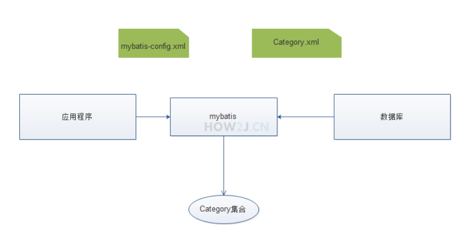
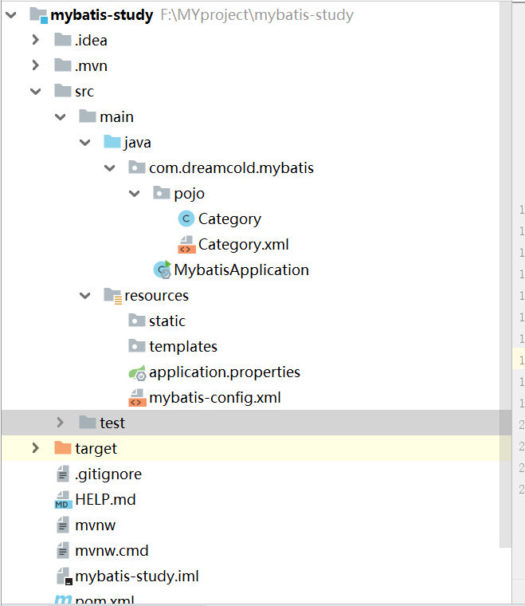

# Mybatis入门

1. 创建数据库

```sql
create database mybatis;
```

2. 创建对应的数据表

```sql
CREATE TABLE CATEGORY(
	ID INT(11) NOT NULL AUTO_INCREMENT,
	NAME VARCHAR(32) DEFAULT NULL,
	PRIMARY KEY(ID)
)ENGINE=MyISAM AUTO_INCREMENT=1 DEFAULT CHARSET=utf8;

```

3. 导入对应的数据

```sql
INSERT INTO CATEGORY VALUES(NULL.'CATAGORY1');
INSERT INTO CATEGORY VALUES(NULL,'CATAGORY2');
```

4. 导入对应的jar包

```xml
        <dependency>
            <groupId>org.mybatis</groupId>
            <artifactId>mybatis</artifactId>
            <version>3.5.6</version>
        </dependency>

        <!-- https://mvnrepository.com/artifact/mysql/mysql-connector-java -->
        <dependency>
            <groupId>mysql</groupId>
            <artifactId>mysql-connector-java</artifactId>
            <version>5.1.40</version>
        </dependency>
```

5. 准备实体类Catagory映射表Catagory

```java
package com.dreamcold.mybatis.pojo;


public class Category {
    private int id;
    private String name;

    public int getId() {
        return id;
    }

    public void setId(int id) {
        this.id = id;
    }

    public String getName() {
        return name;
    }

    public void setName(String name) {
        this.name = name;
    }
}

```

6. 配置文件mybatis-config.xml

在src目录下创建mybatis的主配置文件，mybatis-config.xml其主要偶用是提供连接数据库用的驱动，包括了数据库驱动、数据库名称、编码方式、账号密码

```xml
                <property name="driver" value="com.mysql.jdbc.Driver"/>
                <property name="url" value="jdbc:mysql://localhost:3306/mybatis?characterEncoding=UTF-8&amp;serverTimezone=UTC"/>
                <property name="username" value="root"/>
                <property name="password" value="root"/>
```
以及别名，自动扫描com.dreamcold.mybatis.pojo下的类型，使得在后续的配置文件Category.xml中使用result类型的时候，可以直接使用Category,而不必写全com.dreamcold.mybatis.pojo.Category

```xml
<typeAliases>
    <package name="com.dreamcold.mybatis.pojo.Category"/>
</typeAliases>
```

映射Category.xml

```xml
<mappers>
    <mapper resource="com/dreamcold/mybatis/pojo/Category.xml"/>
</mappers>
```

```xml
<?xml version="1.0" encoding="UTF-8" ?>
<!DOCTYPE configuration
        PUBLIC "-//mybatis.org//DTD Config 3.0//EN"
        "http://mybatis.org/dtd/mybatis-3-config.dtd">
<configuration>
    <typeAliases>
        <package name="com.dreamcold.mybatis.pojo"/>
    </typeAliases>
    <environments default="development">
        <environment id="development">
            <transactionManager type="JDBC"></transactionManager>
            <dataSource type="POOLED">
                <property name="driver" value="com.mysql.jdbc.Driver"/>
                <property name="url" value="jdbc:mysql://localhost:3306/mybatis?characterEncoding=UTF-8&amp;serverTimezone=UTC"/>
                <property name="username" value="root"/>
                <property name="password" value="19990614kang"/>
            </dataSource>
        </environment>
    </environments>
    <mappers>
        <mapper resource="com/dreamcold/mybatis/pojo/Category.xml"/>
    </mappers>
</configuration>
```

7. 配置文件Category.xml

在com.dreamcold.mybatis.pojo包下，新建Category.xml

```xml
namespace="com.dreamcold.mybatis.pojo"
```

表示命名空间是com.dreamcold.mybatis.pojo,在后续调用sql的时候，会用到它

```sql
select * from   category
```

这条sql语句用id: listCategory 进行标示以供后续代码调用。resultType="Category" 表示返回的数据和Category关联起来，这里本应该使用的是com.dreamcold.mybatis.pojo, 但是因为上一步配置了别名，所以直接使用Category就行了

```xml
<?xml version="1.0" encoding="UTF-8"?>
<!DOCTYPE mapper
        PUBLIC "-//mybatis.org//DTD Mapper 3.0//EN"
        "http://mybatis.org/dtd/mybatis-3-mapper.dtd">

<mapper namespace="com.dreamcold.mybatis.pojo">
    <select id="listCategory" resultType="Category">
            select * from   category
    </select>
</mapper>
```

8. 运行并观察到如图所示的结果。
根据配置文件mybatis-config.xml得到sqlSessionFactory 。

```java
String resource = "mybatis-config.xml";
InputStream inputStream = Resources.getResourceAsStream(resource);
SqlSessionFactory sqlSessionFactory = new SqlSessionFactoryBuilder().build(inputStream);
```

然后再根据sqlSessionFactory 得到session

```java
SqlSession session=sqlSessionFactory.openSession();
```

最后通过session的selectList方法，调用sql语句listCategory。listCategory这个就是在配置文件Category.xml中那条sql语句设置的id。
执行完毕之后，得到一个Category集合，遍历即可看到数据。

```java
List<Category> cs = session.selectList("listCategory");
for (Category c : cs) {
	System.out.println(c.getName());
}
```

代码

```java
package com.dreamcold.mybatis;

import com.dreamcold.mybatis.pojo.Category;
import org.junit.jupiter.api.Test;


import java.io.IOException;
import java.io.InputStream;
import java.util.List;

import org.apache.ibatis.io.Resources;
import org.apache.ibatis.session.SqlSession;
import org.apache.ibatis.session.SqlSessionFactory;
import org.apache.ibatis.session.SqlSessionFactoryBuilder;

public class StartTest {
    @Test
    public void test() throws IOException{
        String resource = "mybatis-config.xml";
        InputStream inputStream = Resources.getResourceAsStream(resource);
        SqlSessionFactory sqlSessionFactory = new SqlSessionFactoryBuilder().build(inputStream);
        SqlSession session=sqlSessionFactory.openSession();

        List<Category> cs=session.selectList("listCategory");
        for (Category c : cs) {
            System.out.println(c.getName());
        }
    }
}

```

9. 基本原理图

1. 应用程序找Mybatis要数据
2. mybatis从数据库中找来数据
2.1 通过mybatis-config.xml 定位哪个数据库
2.2 通过Category.xml执行对应的select语句
2.3 基于Category.xml把返回的数据库记录封装在Category对象中
2.4 把多个Category对象装在一个Category集合中
3. 返回一个Category集合





## 总结踩坑

1. 首先时区不对会报错

```xml
           <dataSource type="POOLED">
                <property name="driver" value="com.mysql.jdbc.Driver"/>
                <property name="url" value="jdbc:mysql://localhost:3306/mybatis?characterEncoding=UTF-8&amp;serverTimezone=UTC"/>
                <property name="username" value="root"/>
                <property name="password" value="19990614kang"/>
            </dataSource>
```

2. IDEA是不会编译src的java目录的xml文件，所以在Mybatis的配置文件中找不到xml文件！（也有可能是Maven构建项目的问题，网上教程很多项目是普通的Java web项目，所以可以放到src下面也能读取到）

解决方案1：

不将xml放到src目录下面，将xxxMapper.xml放到Maven构建的resource目录下面！

解决方案2：
在Maven的pom文件中，添加下面代码：

```xml
<build>
        <resources>
            <resource>
                <directory>src/main/java</directory>
                <includes>
                    <include>**/*.xml</include>
                </includes>
            </resource>
        </resources>
    </build>
```

3. 我的项目目录

