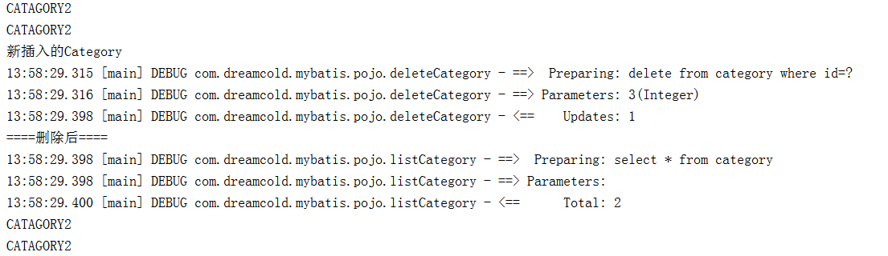
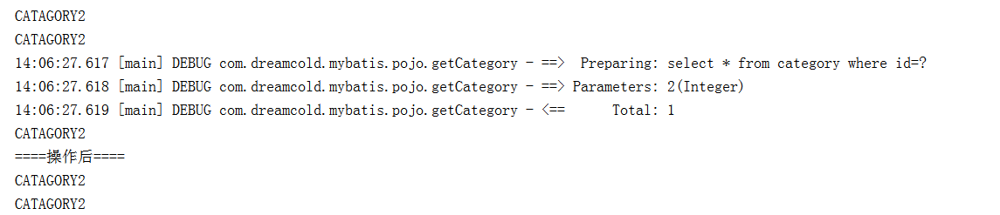

# mybatis实现改查增删

1.配置文件Category.xml

首先一次性的配置文件category.xml,提供对应的crud的sql

```xml
<?xml version="1.0" encoding="UTF-8"?>
<!DOCTYPE mapper
        PUBLIC "-//mybatis.org//DTD Mapper 3.0//EN"
        "http://mybatis.org/dtd/mybatis-3-mapper.dtd">

<mapper namespace="com.dreamcold.mybatis.pojo">
    <select id="listCategory" resultType="Category">
            select * from   category
    </select>

    <delete id="deleteCategory" parameterType="Category">
            delete from category where id=#{id}
    </delete>

    <select id="getCategory" parameterType="_int" resultType="Category">
        select * from category where id=#{id}
    </select>

    <update id="updateCategory" parameterType="Category">
        update category set name=#{name} where id=#{id}
    </update>

    <insert id="insertCategory" parameterType="Category">
        insert into category ( name ) values (#{name})
    </insert>
</mapper>
```

2. 执行插入操作

运行之后，可以看到通过mybatis查询出来的数据中有新增加的Category

通过session.insert调用addCatory对应的SQL语句

```java
    Category c=new Category();
    c.setName("新插入的Category");
    session.insert("insertCategory",c);
```

addCategory对应的插入sql语句，#{name}会自动的获取c对象的属性值

```xml
<insert id="insertCategory" parameterType="Category">
        insert into category ( name ) values (#{name})
</insert>
```    


3. 删除id=3的对象

核心代码片段

```java
        Category c=new Category();
        c.setId(3);
        session.delete("deleteCategory",c);
```


对应xml片段

```xml
    <delete id="deleteCategory" parameterType="Category">
            delete from category where id=#{id}
    </delete>
```

结果



4. 通过session.selectOne获取id=2的记录

```java
Category selectOne=(Category)session.selectOne("getCategory",c);
```

getCategory对应的sql语句：

```xml
    <select id="getCategory" parameterType="_int" resultType="Category">
        select * from category where id=#{id}
    </select>
```

结果




5. 修改

通过session.update进行修改
```java
    Category c=new Category();
    c.setId(2);
    c.setName("修改后的第二个商品种类");
    session.update("updateCategory",c);
```


updateCategory对应的sql语句：

```xml
    <update id="updateCategory" parameterType="Category">
        update category set name=#{name} where id=#{id}
    </update>
```

6. 查询所有

session.selectList执行查询语句
```java
        List<Category> list=sqlSession.selectList("listCategory");
        for(Category c:list){
            System.out.println(c.getName());
        }
```
listCategory对应的sql语句

```xml
    <select id="listCategory" resultType="Category">
            select * from   category
    </select>
```