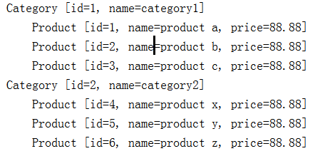

# 一对多查询

一个分类对应多个产品

1. 创建产品表

```sql
use mybatis;
create table product(
id int NOT NULL AUTO_INCREMENT,
name varchar(30)  DEFAULT NULL,
price float  DEFAULT 0,
cid int ,
PRIMARY KEY (id)
)AUTO_INCREMENT=1 DEFAULT CHARSET=utf8;
```

2. 准备数据

清空category 和 product 表
新增2条分类数据，id分别是1,2
新增6条产品数据，分别关联上述2条分类数据

```sql
use mybatis;
delete from category;
INSERT INTO category VALUES (1,'category1');
INSERT INTO category VALUES (2,'category2');
delete from product;
INSERT INTO product VALUES (1,'product a', 88.88, 1);
INSERT INTO product VALUES (2,'product b', 88.88, 1);
INSERT INTO product VALUES (3,'product c', 88.88, 1);
INSERT INTO product VALUES (4,'product x', 88.88, 2);
INSERT INTO product VALUES (5,'product y', 88.88, 2);
INSERT INTO product VALUES (6,'product z', 88.88, 2);
```

3. 新建实体类

普通的一个pojo

```java
package com.dreamcold.mybatis.pojo;

public class Product {
    private int id;
    private String name;
    private float price;

    public int getId() {
        return id;
    }

    public void setId(int id) {
        this.id = id;
    }

    public String getName() {
        return name;
    }

    public void setName(String name) {
        this.name = name;
    }

    public float getPrice() {
        return price;
    }

    public void setPrice(float price) {
        this.price = price;
    }

    @Override
    public String toString() {
        return "Product [id=" + id + ", name=" + name + ", price=" + price + "]";
    }

    
}
```

4. 修改Category实体类，提供products的集合


```java
package com.dreamcold.mybatis.pojo;


import java.util.List;

public class Category {
    private int id;
    private String name;

    List<Product> products;

    public List<Product> getProducts() {
        return products;
    }

    public void setProducts(List<Product> products) {
        this.products = products;
    }

    public int getId() {
        return id;
    }

    public void setId(int id) {
        this.id = id;
    }

    public String getName() {
        return name;
    }

    public void setName(String name) {
        this.name = name;
    }

    @Override
    public String toString() {
        return "Category [id=" + id + ", name=" + name + "]";
    }
}

```

5. 修改Category.xml

通过left join关联查询，对Category和Product表进行关联查询。
与前面学习的有所区别，这里不是用的resultType, 而是resultMap，通过resultMap把数据取出来放在对应的 对象属性里
注： Category的id 字段 和Product的id字段同名，Mybatis不知道谁是谁的，所以需要通过取别名cid,pid来区分。
name字段同理。

```xml
<?xml version="1.0" encoding="UTF-8"?>
<!DOCTYPE mapper
        PUBLIC "-//mybatis.org//DTD Mapper 3.0//EN"
        "http://mybatis.org/dtd/mybatis-3-mapper.dtd">

<mapper namespace="com.dreamcold.mybatis.pojo">

    <resultMap type="Category" id="categoryBean">
        <id column="cid" property="id" />
        <result column="cname" property="name" />

        <!-- 一对多的关系 -->
        <!-- property: 指的是集合属性的值, ofType：指的是集合中元素的类型 -->
        <collection property="products" ofType="Product">
            <id column="pid" property="id" />
            <result column="pname" property="name" />
            <result column="price" property="price" />
        </collection>
    </resultMap>


    <delete id="deleteCategory" parameterType="Category">
            delete from category where id=#{id}
    </delete>

    <select id="getCategory" parameterType="_int" resultType="Category">
        select * from category where id=#{id}
    </select>

    <update id="updateCategory" parameterType="Category">
        update category set name=#{name} where id=#{id}
    </update>

    <insert id="insertCategory" parameterType="Category">
        insert into category ( name ) values (#{name})
    </insert>

    <select id="listCategoryByName" parameterType="string" resultType="Category">
         select * from   category  where name like concat('%',#{0},'%')
    </select>
    
    <select id="listCategoryByIdAndName" parameterType="map" resultType="Category">
         select * from   category  where id> #{id}  and name like concat('%',#{name},'%')
    </select>

    <!-- 关联查询分类和产品表 -->
    <select id="listCategory" resultMap="categoryBean">
            select c.*, p.*, c.id 'cid', p.id 'pid', c.name 'cname', p.name 'pname' from category c left join product p on c.id = p.cid
    </select>
</mapper>
```

6. 测试运行

```java
  @Test
    public void test() throws IOException{
        String resource = "mybatis-config.xml";
        InputStream inputStream = Resources.getResourceAsStream(resource);
        SqlSessionFactory sqlSessionFactory = new SqlSessionFactoryBuilder().build(inputStream);
        SqlSession session=sqlSessionFactory.openSession();
        listAll(session);
        session.commit();
        session.close();
    }


    private void listAll(SqlSession sqlSession){
        List<Category> list=sqlSession.selectList("listCategory");
        for(Category c:list){
            System.out.println(c);
            List<Product> products=c.getProducts();
            for(Product p:products){
                System.out.println("\t"+p);
            }
        }
    }
```


