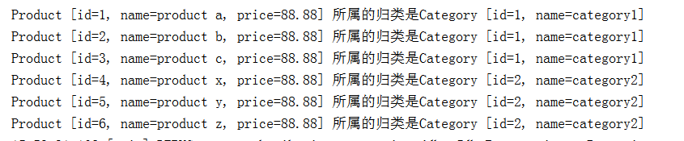

# 多对一查询

查询出所有的产品，同时对于每个产品，还能看到其所对应的分类

1. 修改Product.java顶折纠问
为Product增加category属性

```java
package com.dreamcold.mybatis.pojo;

public class Product {
    private int id;
    private String name;
    private float price;
    private Category category;

    public Category getCategory() {
        return category;
    }

    public void setCategory(Category category) {
        this.category = category;
    }

    public int getId() {
        return id;
    }

    public void setId(int id) {
        this.id = id;
    }

    public String getName() {
        return name;
    }

    public void setName(String name) {
        this.name = name;
    }

    public float getPrice() {
        return price;
    }

    public void setPrice(float price) {
        this.price = price;
    }

    @Override
    public String toString() {
        return "Product [id=" + id + ", name=" + name + ", price=" + price + "]";
    }


}

```

2. Product.xml顶折纠问
提供Product.xml，通过listProduct配置关联查询的sql语句。
然后通过resultMap ，进行字段和属性的对应。
使用association 进行多对一关系关联，指定表字段名称与对象属性名称的一一对应关系
注： Category的id 字段 和Product的id字段同名，Mybatis不知道谁是谁的，所以需要通过取别名cid,pid来区分。
name字段同理。

```xml
<?xml version="1.0" encoding="UTF-8"?>
<!DOCTYPE mapper
        PUBLIC "-//mybatis.org//DTD Mapper 3.0//EN"
        "http://mybatis.org/dtd/mybatis-3-mapper.dtd">
<mapper namespace="com.how2java.pojo">
    <resultMap type="Product" id="productBean">
        <id column="pid" property="id" />
        <result column="pname" property="name" />
        <result column="price" property="price" />

        <!-- 多对一的关系 -->
        <!-- property: 指的是属性名称, javaType：指的是属性的类型 -->
        <association property="category" javaType="Category">
            <id column="cid" property="id"/>
            <result column="cname" property="name"/>
        </association>
    </resultMap>

    <!-- 根据id查询Product, 关联将Orders查询出来 -->
    <select id="listProduct" resultMap="productBean">
            select c.*, p.*, c.id 'cid', p.id 'pid', c.name 'cname', p.name 'pname' from category c left join product p on c.id = p.cid
        </select>
</mapper>
```

3. mybatis-config.xml顶折纠问
在mybatis-config.xml中增加对于Product.xml的映射

```xml
<?xml version="1.0" encoding="UTF-8" ?>
<!DOCTYPE configuration
        PUBLIC "-//mybatis.org//DTD Config 3.0//EN"
        "http://mybatis.org/dtd/mybatis-3-config.dtd">
<configuration>
    <typeAliases>
        <package name="com.dreamcold.mybatis.pojo"/>
    </typeAliases>
    <environments default="development">
        <environment id="development">
            <transactionManager type="JDBC"></transactionManager>
            <dataSource type="POOLED">
                <property name="driver" value="com.mysql.jdbc.Driver"/>
                <property name="url" value="jdbc:mysql://localhost:3306/mybatis?characterEncoding=UTF-8&amp;serverTimezone=UTC"/>
                <property name="username" value="root"/>
                <property name="password" value="root"/>
            </dataSource>
        </environment>
    </environments>
    <mappers>
        <mapper resource="com/dreamcold/mybatis/pojo/Category.xml"/>
        <mapper resource="com/dreamcold/mybatis/pojo/Product.xml" />
    </mappers>
</configuration>
```

4. 测试

```java
    public static void main(String[] args) throws IOException {
        String resource = "mybatis-config.xml";
        InputStream inputStream = Resources.getResourceAsStream(resource);
        SqlSessionFactory sqlSessionFactory = new SqlSessionFactoryBuilder().build(inputStream);
        SqlSession session = sqlSessionFactory.openSession();
        List<Product> products=session.selectList("listProduct");
        for(Product product:products){
            System.out.println(product+"\t"+"所属的归类是"+product.getCategory());
        }
        session.commit();
        session.close();
    }
```

